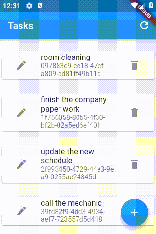

# e006_flutter_hero_animation_on_icon_e004base

## Step 1

    IconButton(
        icon: Hero(
            tag: taskOpj.guid,
            child: Icon(Icons.edit),
    ),

## Step 2

    IconButton(
    icon: Hero(
        tag: widget.taskOpj.guid,
        child:   Icon(Icons.save),
    ),
    onPressed: _save,
    ),

## Step 3

    onPressed: () => Navigator.push(
        context,
        MaterialPageRoute(
        builder: (context) {
            return TaskEditPageWidget(
            taskOpj: taskOpj,
            notifyParent: notifyParent,
            );
        },
        ),
    ),

## Ref

- [Hero (Flutter Widget of the Week) - YouTube](https://www.youtube.com/watch?v=Be9UH1kXFDw)

- [Hero Animations - Flutter](https://flutter.dev/docs/development/ui/animations/hero-animations)

- [Search · hero](https://github.com/flutter/flutter/search?p=2&q=hero&unscoped_q=hero)

